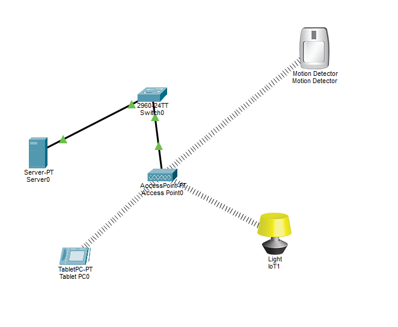
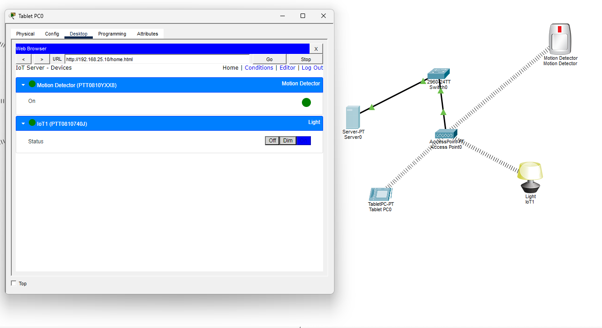

# Cisco Packet Tracer - Smart IoT Automation Network

This repository contains a Cisco Packet Tracer topology demonstrating how to configure and deploy smart IoT devices connected to a centralized **Registration Server**. 

The network implements automated smart home rules using a **Wireless Access Point (WAP)**, a **Tablet controller**, a **Motion Detector**, and an **IoT Light**.

---

## Topology Overview

Here is the visual layout of the completed network topology:

<!-- ADD YOUR TOPOLOGY SCREENSHOT HERE -->

---

## Network Specifications & IP Addressing

All communication routes through a central Cisco Catalyst Switch, linking the wired server infrastructure with the wireless client network.

| Device | Interface | IP Address | Subnet Mask | Connection Type | Connected To |
| :--- | :--- | :--- | :--- | :--- | :--- |
| **Cisco Switch** | VLAN 1 | *N/A (Layer 2)* | *N/A* | Wired Backbone | Server & WAP |
| **Registration Server** | FastEthernet0 | `192.168.25.10` | `255.255.255.0` | Copper Straight-Through | Switch Port (FA0/1) |
| **Wireless AP (WAP)** | Port 0 | *N/A* | *N/A* | Copper Straight-Through | Switch Port (FA0/2) |
| **Tablet Controller** | Wireless0 | `192.168.25.20` | `255.255.255.0` | Wireless Link | WAP (`IoT-WiFi`) |
| **Motion Detector** | Wireless0 | `192.168.25.30` | `255.255.255.0` | Wireless Link | WAP (`IoT-WiFi`) |
| **Smart IoT Light** | Wireless0 | `192.168.25.31` | `255.255.255.0` | Wireless Link | WAP (`IoT-WiFi`) |

---

## Configuration Steps

### 1. Registration Server Setup
* Configured a dedicated server with the static IP `192.168.25.10`.
* Enabled the **IoT Service** under the server's *Services* tab.

### 2. Wireless & Tablet Connection
* Deployed a Wireless Access Point (WAP) with the SSID set to `IoT-WiFi` (Open Authentication).
* Configured the **Tablet** to connect to `IoT-WiFi` with a static IP of `192.168.25.20`.
* Accessed the registration server dashboard via the tablet's web browser (`http://192.168.25.10`) and created an administrative user account.

### 3. IoT Device Deployment
* Swapped the physical network modules on both the **Motion Detector** and **Light** to the wireless `PT-IOT-NM-1W` interface.
* Connected both devices to the `IoT-WiFi` SSID and assigned them unique static IPs.
* Configured both devices to point to the **Remote Server** address `192.168.25.10` using the tablet's admin credentials.

---

## Smart Automation Rules (Conditions)

Using the Registration Server dashboard interface, the following automated conditions were built to link the sensor to the light:

1. **Motion Detected On**: `IF` Motion Detector On is `True` `THEN` Smart Light Status is `On`.
2. **Motion Detected Off**: `IF` Motion Detector On is `False` `THEN` Smart Light Status is `Off`.

### IoT Server Dashboard Status:
<!-- ADD YOUR TABLET IOT DASHBOARD SCREENSHOT HERE -->

> **Note on Behavior:** Packet Tracer applies a built-in 5-second cooldown timer to the Motion Detector. When motion triggers, the light illuminates instantly and stays on for 5 seconds until the physical sensor resets back to an 'Off' state.

---

## How to Run This Project
1. Download the `.pkt` file from this repository.
2. Open it using **Cisco Packet Tracer**.
3. Hold down the **ALT key** and hover your mouse over the **Motion Detector** to simulate movement and watch the automation run live!
